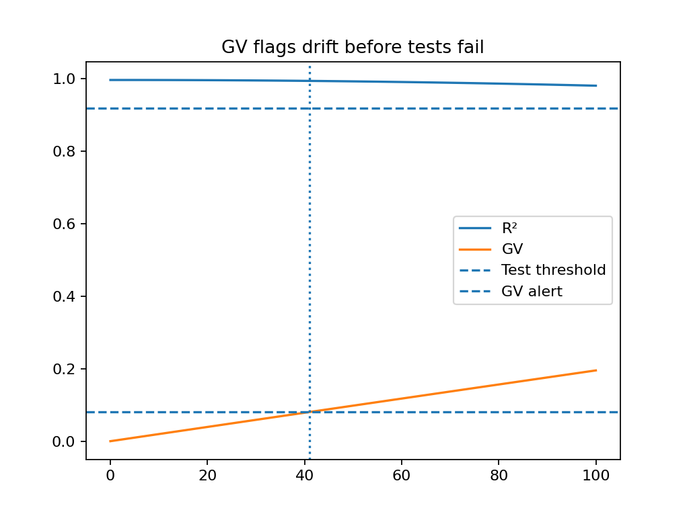

> **Start here (Hub):** https://github.com/willshacklett/god-variable-theory  
> One-click ecosystem map • demos • CI enforcement • runtime monitoring

# GV Drift Demo

**A minimal demonstration of a drift scalar detecting regression _before_ CI tests fail.**

This repository shows a simple but common failure mode in CI systems:

> Tests pass. Metrics look stable.  
> The system is drifting anyway.

The demo introduces a lightweight scalar (“GV”) that flags this drift **earlier** than a conventional test threshold.

---

## What this demonstrates

The simulation runs a fixed dataset against a model that degrades *gradually* over time.

- **R²** remains above the test threshold for many steps
- **GV** increases steadily as the system drifts
- GV crosses its alert threshold **before** tests fail

That gap is the value.

---

## Output (generated by `simulate.py`)



- Horizontal dashed line (top): CI test threshold  
- Horizontal dashed line (bottom): GV alert threshold  
- Vertical dotted line: first GV alert  
- Tests fail later

This is a controlled, reproducible example of **early warning vs late failure**.

---

## Why this matters

In real systems:
- Regressions often accumulate slowly
- Tests are binary and lagging
- Failures arrive after damage is already done

An early drift signal gives you time to:
- investigate
- halt a rollout
- tighten constraints
- prevent irreversible changes

GV is not a replacement for tests.  
It’s a **canary**.

---

## How to run

```bash
pip install -r requirements.txt
python simulate.py
